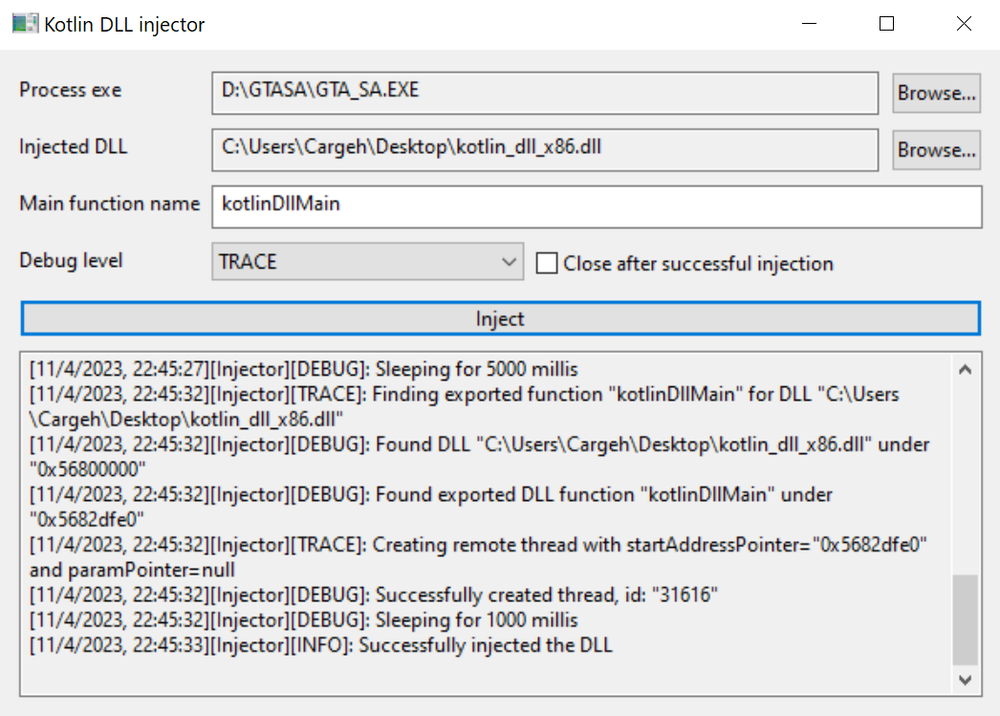

# Injector4k

Injector4k is a DLL injector for Kotlin/Native applications, built with Kotlin/Native.

"Hold up, why do we need yet another DLL injector? There are so many of them!" - you might say, and you'd be right.
See [not your average injector](#not-your-average-injector) for an explanation.

> **Note**
> Currently, Injector4k only works with 32-bit (x86) Windows programs, but you can run it on 64-bit Windows just fine.
>
> It can be used for messing around with the original versions of retro games from circa 2005, like
> `Grand Theft Auto: San Andreas` or `World of Warcraft: The Burning Crusade`, as most of them have 32-bit executables.

## Getting started

Below you will find everything you need to know to get you started with Kotlin DLL injections.

### DLL

You should begin with acquiring or producing a compatible Kotlin/Native DLL.

If you already have one, you can skip to [GUI](#gui) or [Library](#library) sections.

#### Pre-built example

If you would like to take Injector4k for a spin first, you can download an example DLL from the [Releases][1] page. Once
the example DLL is injected, it will sleep for 10 seconds, and then create a harmless "Hello World" pop-up window -
similar to JavaScript's `alert()`. You can find the source code
[here](dll-example/src/nativeMain/kotlin/me/beresnev/injector/example/KotlinDllMain.kt).

#### Custom

If you would like to produce your own `.dll`, you can use [dll-example](dll-example) as a starting point, or follow
the [Kotlin/Native as a dynamic library](https://kotlinlang.org/docs/native-dynamic-libraries.html) tutorial on
kotlinlang.org.

The most important part is to export your entry-point function with `@CName`:

```kotlin
@CName("kotlinDllMain")
fun kotlinDllMain() {
  // logic
}
```

Beware that the bitness of the DLL you produce must be the same as the program you want to inject it into. So if you
want to inject some code into a 32-bit game, like GTA: SA, you will have to use the `mingwX86` target.

### GUI

Injector4k comes with a basic graphical user interface for injecting arbitrary DLLs:



You can download the latest version from the [Releases][1] page.

> **Note**
> Depending on the program you're going to be injecting into, you should choose between `x86` and `x64` versions of
> injector4k. Selecting the wrong version will not damage your computer, but it will fail with obscure errors during
> the injection.

### Library

Injector4k can also be embedded into your own program:

```kotlin
import me.beresnev.injector.Injector
import me.beresnev.injector.logger.PrintlnLogger

Injector(injectorLogger = PrintlnLogger).inject(
  executablePath = "D:\\GTASA\\GTA_SA.EXE",
  dllPath = "C:\\Users\\Cargeh\\Desktop\\kotlin_dll_x86.dll",
  mainFunctionName = "kotlinDllMain",
)
```

> **Note**
> Injector4k artifacts haven't been published yet, but they will be available by April 30th.

[1]: https://github.com/IgnatBeresnev/injector4k/releases

## Tips

Some tips and tricks to ease the development of your DLLs:

* When in doubt, google for C++ solutions, and adapt them to Kotlin. The Windows API mapping that comes built-in with
  Kotlin/Native is pretty much one to one, so it should not be difficult.
* When not sure how to call some Windows API from Kotlin/Native, use
  [GitHub Advanced Search](https://github.com/search?l=Kotlin&q=CreateProcessW+language%3AKotlin&type=code). Odds are,
  someone has already done it.
* Once your DLL is injected into a process, first thing you'll notice is the absence of feedback - you will not know
  what it's doing and if it's even being executed, or if it failed with an error. The DLL can, of course, spin up a
  GUI of its own, or write logs to a common file, but you can simply use the
  [OutputDebugStringW](https://learn.microsoft.com/en-us/windows/win32/api/debugapi/nf-debugapi-outputdebugstringw)
  win-api function for println debugging. You will be able to see the messages you output in your DLL in the
  [DebugView](https://learn.microsoft.com/en-us/sysinternals/downloads/debugview) utility application. Write strings
  with a prefix like `[MyDll]` to filter out the noise from other programs.
* Many popular games have been reverse engineered, so most likely there's a forum or a wiki out there that contains
  various memory and function addresses, as well as more specific instructions. To find simple value addresses,
  [use Cheat Engine](https://www.youtube.com/watch?v=KYCcm5AEBNg). To do serious reverse engineering, use
  [IDA](https://hex-rays.com/ida-free/).

## Not your average injector

Unfortunately, most traditional DLL injectors rely on the injected DLL implementing a special
[DllMain](https://learn.microsoft.com/en-us/windows/win32/dlls/dllmain) function, which you cannot produce with
Kotlin/Native as it does not support adding the required `WINAPI` (`__stdcall`) calling convention.

You can write an intermediate DLL wrapper in C++: you first inject the wrapper, and then the wrapper calls your
Kotlin/Native code - it'll work. But who wants to be dealing with C++ when you don't have to?

Thankfully, you can use Injector4k to perform an organic, 100% pure, Kotlin DLL injection, all the way from the
injector to the injected code.

___

# TODO

Currently, Injector4k is in public Beta - it works, but with some limitations and inconveniences.

Here's what needs to be done for the 1.0 Stable release:

1. Support 64-bit Windows programs.
2. Publish the injector as a library.
3. Add more documentation and technical details for both the problem and the solution.
4. Create a GitHub template for starting out with writing DLLs.
5. Add GitHub action workflows.
